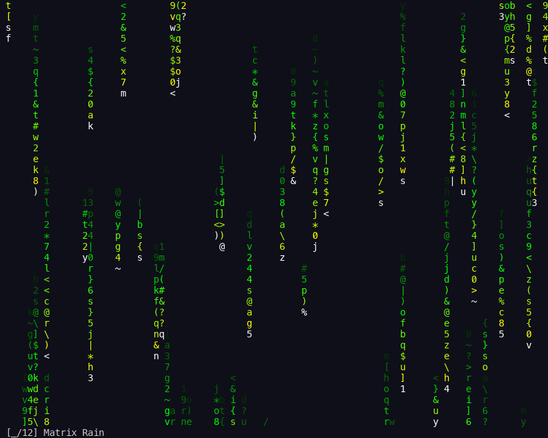
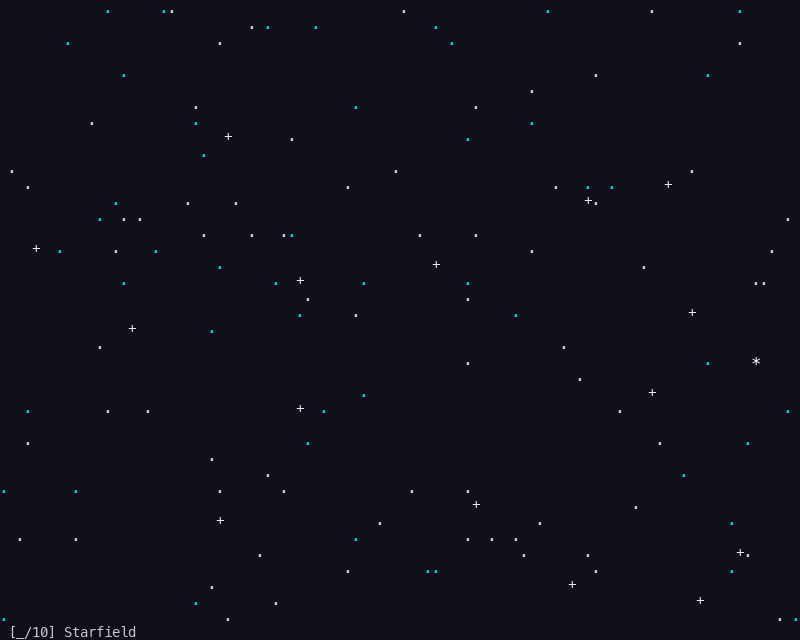
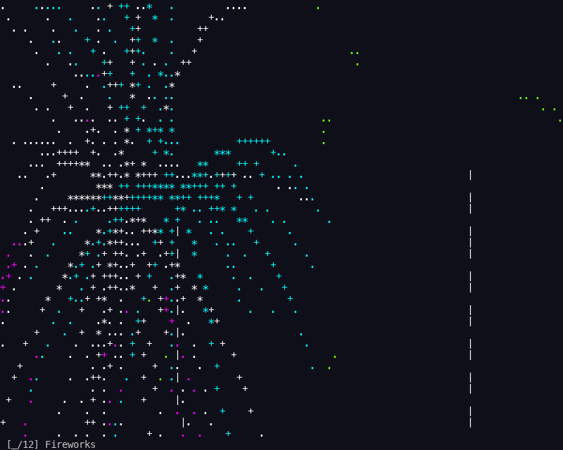
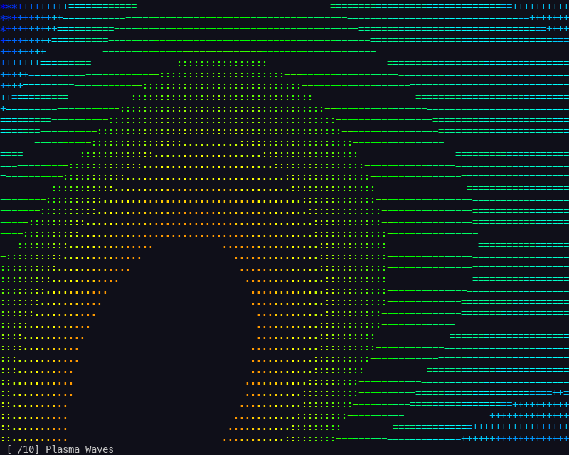
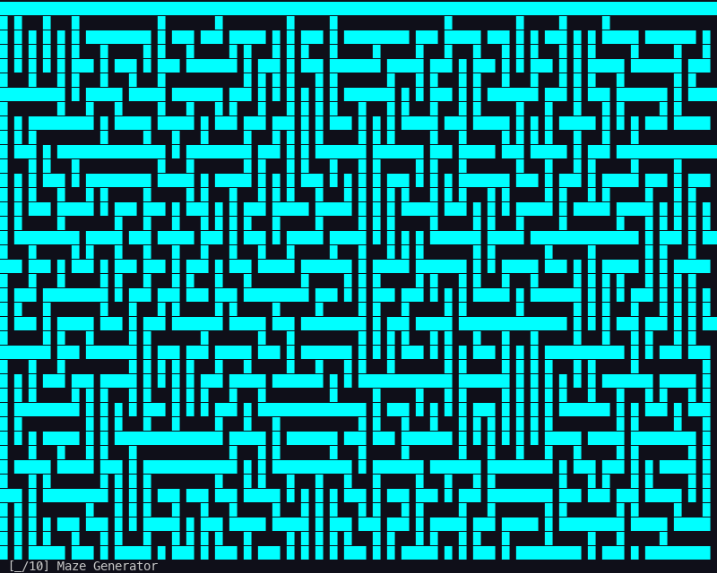

<div align="center">

# 🎨 Art Gallery

**Interactive terminal art gallery with 6 generative art animations — pure Python, zero dependencies**

[](#)
[](#)
[](#)

[Features](#-features) · [Screenshots](#-screenshots) · [Getting Started](#-getting-started) · [Tech Stack](#️-tech-stack)

</div>

---

## 📸 Screenshots

| Matrix Rain | Starfield | Fireworks |
|:-:|:-:|:-:|
|  |  |  |

| Game of Life | Plasma Waves | Maze Generator |
|:-:|:-:|:-:|
|  |  |  |

## ✨ Features

- **Matrix Rain** — Cascading green characters inspired by The Matrix
- **Starfield** — 3D space simulation flying through stars
- **Fireworks** — Colorful particle bursts with realistic gravity physics
- **Game of Life** — Conway's cellular automaton with color-coded cell age
- **Plasma Waves** — Smooth undulating rainbow gradient effects
- **Maze Generator** — Real-time recursive backtracking maze carving
- **Keyboard Navigation** — Switch between exhibits with arrow keys or number keys, pause/resume, and reset

## 🚀 Getting Started

### Prerequisites
- Python 3.6+
- A terminal with color support (256-color recommended)

### Installation

```bash
git clone https://github.com/markksantos/art_gallery.git
cd art_gallery
python3 art_gallery.py
```

### Controls

| Key | Action |
|-----|--------|
| `Left` / `Right` | Switch between animations |
| `1`–`6` | Jump to a specific animation |
| `Space` | Pause / Resume |
| `r` | Reset current animation |
| `q` | Quit |

## 🛠️ Tech Stack

| Category | Technology |
|----------|-----------|
| Language | Python 3.6+ |
| Rendering | curses (stdlib) |
| Dependencies | None — stdlib only |

## 📁 Project Structure

```
art_gallery/
├── art_gallery.py          # All 6 animations + gallery navigation
├── screenshots/            # Generated animation screenshots
└── README.md
```

## 📄 License

MIT License © 2025 Mark Santos
